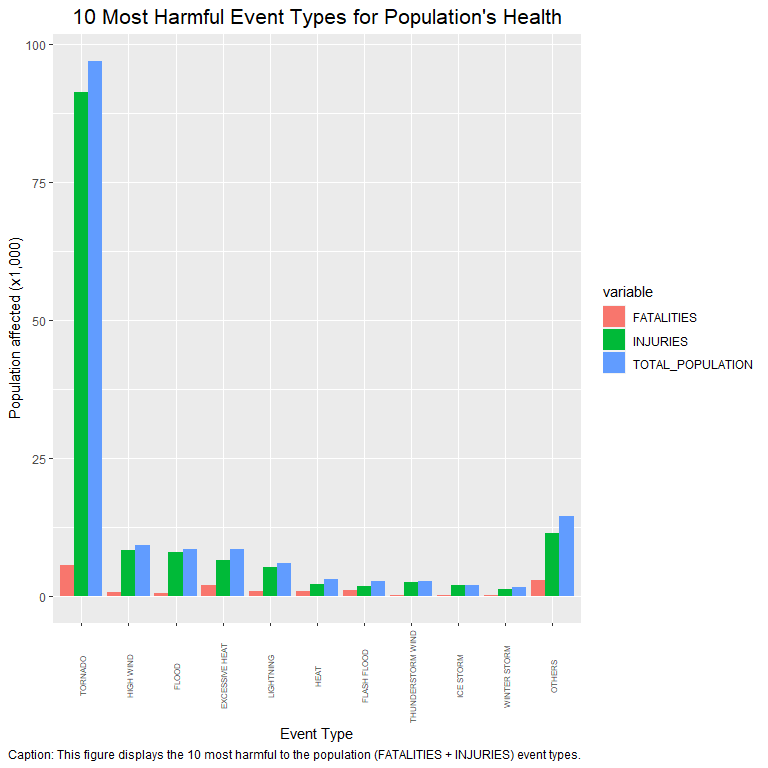
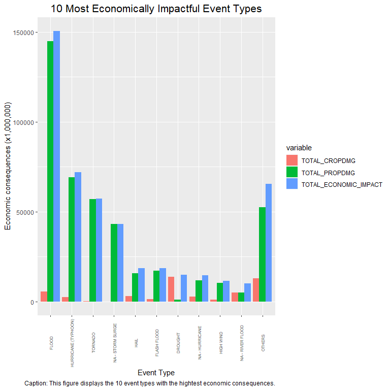

## Synopsis

This document describes all of the steps required to complete the Reproducible Research JHU-Coursera, Course Project 2. These include reading and exploring the NOAA Storm Database in order to identify the Tornados as the most harmful event types with respect to the population health, and Floods as the most economically impactful event typs across the United States.

To achieve this, several pre-processing actions were carried out such as validating the event type field values agains the official event list provided in the following link: <https://d396qusza40orc.cloudfront.net/repdata%2Fpeer2_doc%2Fpd01016005curr.pdf>. After that, the harm to the population health was calculated by adding the total number of fatalities and injuries. The economical consequences, on the other hand, were calculated by adding the total value of property and crop damages generated.

Finally, both the population harm, and the economic impacts were plotted using ggplot2.

## Data Processing

Below you will find the steps and code for loading and processing the NOAA Storm Database:

1. Downloading and extracting data file.


```r
fileURL <- 'https://d396qusza40orc.cloudfront.net/repdata%2Fdata%2FStormData.csv.bz2'
filename <- 'NOAAStormData.csv.bz2'
if (!file.exists(filename)){
        download.file(fileURL, filename, method = "curl")
}
```

2. Reading data file into R.


```r
## NOAA Storm data file
NOAAStormData <- read.table(filename, sep = ',', header = TRUE)
NOAAStormData <- tibble::as_tibble(NOAAStormData)
NOAAStormData$BGN_DATE <- mdy_hms(NOAAStormData$BGN_DATE)
## 48 event types from https://d396qusza40orc.cloudfront.net/repdata%2Fpeer2_doc%2Fpd01016005curr.pdf
EventType <- c('Astronomical Low Tide', 'Avalanche', 'Blizzard', 'Coastal Flood', 'Cold/Wind Chill', 'Debris Flow',
               'Dense Fog', 'Dense Smoke', 'Drought', 'Dust Devil', 'Dust Storm', 'Excessive Heat',
               'Extreme Cold/Wind Chill', 'Flash Flood', 'Flood', 'Frost/Freeze', 'Funnel Cloud',
               'Freezing Fog', 'Hail', 'Heat', 'Heavy Rain', 'Heavy Snow', 'High Surf', 'High Wind',
               'Hurricane (Typhoon)', 'Ice Storm', 'Lake-Effect Snow', 'Lakeshore Flood', 'Lightning',
               'Marine Hail', 'Marine High Wind', 'Marine Strong Wind', 'Marine Thunderstorm Wind',
               'Rip Current', 'Seiche', 'Sleet', 'Storm Surge/Tide', 'Strong Wind',
               'Thunderstorm Wind', 'Tornado', 'Tropical Depression', 'Tropical Storm', 'Tsunami',
               'Volcanic Ash', 'Waterspout', 'Wildfire', 'Winter Storm', 'Winter Weather')
```

3. Adjusting EVTYPE column into the ADJ_EVTYPE variable by using the amatch() function from the 'stringdist' package against the official 48 Event Type list taken from the following url: <https://d396qusza40orc.cloudfront.net/repdata%2Fpeer2_doc%2Fpd01016005curr.pdf>. The maxDist parameter was set to 4 (allowing combinations of up to 4 edits). Also, for non matched values, default NAs were replaced with the concatenation of 'NA - ' and the actual EVTYPE value.


```r
## Validating event type from list
NOAAStormData <-  NOAAStormData %>%
        mutate(EVTYPE = toupper(EVTYPE)) %>%
        mutate(ADJ_EVTYPE = toupper(EventType[amatch(EVTYPE, toupper(EventType), maxDist = 4)])) %>% 
        mutate(ADJ_EVTYPE = ifelse(is.na(ADJ_EVTYPE), paste0('NA - ', EVTYPE), ADJ_EVTYPE))
```

4. Processing population health consequences by adding fatalities and injuries. Also, calculating the percentage of total population affected per event type against all added fatalities and injuries.


```r
## Calculating the total population affected and percentage
NOAAStormData <-  NOAAStormData %>% 
        mutate(TOTAL_POPULATION = FATALITIES + INJURIES) %>%
        mutate(PERCENT_TOTAL_POPULATION = (TOTAL_POPULATION / sum(TOTAL_POPULATION))*100)
## Aggregating by event type
NOAAStormData_Most_Population_Harmful_types <- NOAAStormData %>% 
        select(c(ADJ_EVTYPE, FATALITIES, INJURIES, TOTAL_POPULATION, PERCENT_TOTAL_POPULATION)) %>% 
        group_by(ADJ_EVTYPE) %>% 
        summarise_all(sum, na.rm = TRUE) %>% 
        arrange(desc(TOTAL_POPULATION))
```

5. Selecting the 10 most harmful event types related to population health (INJURIES + FATALITIES), and calculating the impact of a new "OTHERS" category, aggregating all the other event types.


```r
## Selecting only the 10 most harmful events
NOAAStormData_Most_Population_Harmful_types <- NOAAStormData_Most_Population_Harmful_types[1:10, ]
## Adding the "OTHERS" category
NOAAStormData_Most_Population_Harmful_types <- rbind(NOAAStormData_Most_Population_Harmful_types, c('OTHERS', 
        (sum(NOAAStormData$FATALITIES)-sum(NOAAStormData_Most_Population_Harmful_types$FATALITIES)), 
        (sum(NOAAStormData$INJURIES)-sum(NOAAStormData_Most_Population_Harmful_types$INJURIES)), 
        (sum(NOAAStormData$TOTAL_POPULATION)-sum(NOAAStormData_Most_Population_Harmful_types$TOTAL_POPULATION)), 
        (sum(NOAAStormData$PERCENT_TOTAL_POPULATION)-sum(NOAAStormData_Most_Population_Harmful_types$PERCENT_TOTAL_POPULATION))))
## Adjusting the column data types
NOAAStormData_Most_Population_Harmful_types$FATALITIES <- as.numeric(NOAAStormData_Most_Population_Harmful_types$FATALITIES)
NOAAStormData_Most_Population_Harmful_types$INJURIES <- as.numeric(NOAAStormData_Most_Population_Harmful_types$INJURIES)
NOAAStormData_Most_Population_Harmful_types$TOTAL_POPULATION <- as.numeric(NOAAStormData_Most_Population_Harmful_types$TOTAL_POPULATION)
NOAAStormData_Most_Population_Harmful_types$PERCENT_TOTAL_POPULATION <- as.numeric(NOAAStormData_Most_Population_Harmful_types$PERCENT_TOTAL_POPULATION)
NOAAStormData_Most_Population_Harmful_types$ADJ_EVTYPE <- factor(NOAAStormData_Most_Population_Harmful_types$ADJ_EVTYPE, levels = NOAAStormData_Most_Population_Harmful_types$ADJ_EVTYPE)
```

6. Adjusting the crop and property total damage by replacing the EXP fields with the logic as per the discussion described in <https://www.coursera.org/learn/reproducible-research/discussions/weeks/4/threads/38y35MMiEeiERhLphT2-QA>. Total Economic impact is calculated as the sum of EXP replaced value multipled by the CROPDMG and PROPDMG fields values.


```r
## Adjusting the crop and property damage values based on the EXP fields values
NOAAStormData <-  NOAAStormData %>% 
        mutate(TOTAL_CROPDMG = ifelse(tolower(CROPDMGEXP) == 'h', 100, ifelse(tolower(CROPDMGEXP) == 'k', 1000, ifelse(tolower(CROPDMGEXP) == 'm', 1000000, ifelse(tolower(CROPDMGEXP) == 'b', 1000000000, ifelse((CROPDMGEXP %in% c('-', '+', '?', '')), 1, 10^as.numeric(CROPDMGEXP))))))) %>% 
        mutate(TOTAL_PROPDMG = ifelse(tolower(PROPDMGEXP) == 'h', 100, ifelse(tolower(PROPDMGEXP) == 'k', 1000, ifelse(tolower(PROPDMGEXP) == 'm', 1000000, ifelse(tolower(PROPDMGEXP) == 'b', 1000000000, ifelse((PROPDMGEXP %in% c('-', '+', '?', '')), 1, 10^as.numeric(PROPDMGEXP))))))) %>% 
        mutate(TOTAL_CROPDMG = TOTAL_CROPDMG*CROPDMG, TOTAL_PROPDMG = TOTAL_PROPDMG*PROPDMG)
```

```
## Warning in ifelse((CROPDMGEXP %in% c("-", "+", "?", "")), 1,
## 10^as.numeric(CROPDMGEXP)): NAs introduced by coercion
```

```
## Warning in ifelse((PROPDMGEXP %in% c("-", "+", "?", "")), 1,
## 10^as.numeric(PROPDMGEXP)): NAs introduced by coercion
```

```r
## Calculating economic consequences as the sum of the total crop and property damage
NOAAStormData <-  NOAAStormData %>% 
        mutate(TOTAL_ECONOMIC_IMPACT = TOTAL_CROPDMG + TOTAL_PROPDMG)
```

7. Selecting the 10 most harmful event types related to economic consequences (TOTAL CROP DAMAGE + TOTAL PROPERTY DAMAGE), and calculating the impact of a new "OTHERS" category, aggregating all the other event types.


```r
## Aggregating by event type
NOAAStormData_Most_Economic_Harmful_types <- NOAAStormData %>% 
        select(c(ADJ_EVTYPE, TOTAL_CROPDMG, TOTAL_PROPDMG, TOTAL_ECONOMIC_IMPACT)) %>% 
        group_by(ADJ_EVTYPE) %>% 
        summarise_all(sum, na.rm = TRUE) %>% 
        arrange(desc(TOTAL_ECONOMIC_IMPACT))
## Selecting only the 10 most harmful events
NOAAStormData_Most_Economic_Harmful_types <- NOAAStormData_Most_Economic_Harmful_types[1:10, ]
## Adding the "OTHERS" category
NOAAStormData_Most_Economic_Harmful_types <- rbind(NOAAStormData_Most_Economic_Harmful_types, c('OTHERS', 
        (sum(NOAAStormData$TOTAL_CROPDMG)-sum(NOAAStormData_Most_Economic_Harmful_types$TOTAL_CROPDMG)), 
        (sum(NOAAStormData$TOTAL_PROPDMG)-sum(NOAAStormData_Most_Economic_Harmful_types$TOTAL_PROPDMG)), 
        (sum(NOAAStormData$TOTAL_ECONOMIC_IMPACT)-sum(NOAAStormData_Most_Economic_Harmful_types$TOTAL_ECONOMIC_IMPACT))))
## Adjusting the column data types
NOAAStormData_Most_Economic_Harmful_types$TOTAL_CROPDMG <- as.numeric(NOAAStormData_Most_Economic_Harmful_types$TOTAL_CROPDMG)
NOAAStormData_Most_Economic_Harmful_types$TOTAL_PROPDMG <- as.numeric(NOAAStormData_Most_Economic_Harmful_types$TOTAL_PROPDMG)
NOAAStormData_Most_Economic_Harmful_types$TOTAL_ECONOMIC_IMPACT <- as.numeric(NOAAStormData_Most_Economic_Harmful_types$TOTAL_ECONOMIC_IMPACT)
NOAAStormData_Most_Economic_Harmful_types$ADJ_EVTYPE <- factor(NOAAStormData_Most_Economic_Harmful_types$ADJ_EVTYPE, levels = NOAAStormData_Most_Economic_Harmful_types$ADJ_EVTYPE)
```

## Results

Below you will find the steps and code for plotting and presenting the results of the assignment:

1. Plotting the 10 most harmful event types for the Population Health across the United States.


```r
## Transforming to long-data format structure
NOAAStormData_Most_Population_Harmful_types2 <- reshape2::melt(NOAAStormData_Most_Population_Harmful_types, id.vars = 'ADJ_EVTYPE')
NOAAStormData_Most_Population_Harmful_types2 <- NOAAStormData_Most_Population_Harmful_types2[NOAAStormData_Most_Population_Harmful_types2$variable %in% c('INJURIES', 'FATALITIES', 'TOTAL_POPULATION'), ]
NOAAStormData_Most_Population_Harmful_types2$value <- NOAAStormData_Most_Population_Harmful_types2$value/ 1000
## Generating graph
print({
        g <- ggplot(NOAAStormData_Most_Population_Harmful_types2, aes(x = ADJ_EVTYPE, value, fill = variable))
        g + geom_col(position = "dodge") +
        ggtitle("10 Most Harmful Event Types for Population's Health") +
        labs(caption = 'Caption: This figure displays the 10 most harmful to the population (FATALITIES + INJURIES) event types.') +
        xlab('Event Type') +
        ylab('Population affected (x1,000)') +
        theme(plot.title = element_text(hjust = 0.5, size = 16)) +
        theme(axis.text.x = element_text(size = 6, angle = 90, hjust = .5, vjust = .5, face = "plain")) 
})
```

<!-- -->

The plot above indicates Tornados have by far the most fatalities and injuries recorded throughout the entire dataset. High Winds and Floods, very close together, appear to be the second and third highest types of events with the second and third total number of injuries. Excesive Heat, on the other hand seems to have the second greatest number of fatalities.

2. Plotting the 10 event types with highest economic consequences across the United States.


```r
## Transforming to long-data format structure
NOAAStormData_Most_Economic_Harmful_types2 <- reshape2::melt(NOAAStormData_Most_Economic_Harmful_types, id.vars = 'ADJ_EVTYPE')
NOAAStormData_Most_Economic_Harmful_types2 <- NOAAStormData_Most_Economic_Harmful_types2[NOAAStormData_Most_Economic_Harmful_types2$variable %in% c('TOTAL_CROPDMG', 'TOTAL_PROPDMG', 'TOTAL_ECONOMIC_IMPACT'), ]
NOAAStormData_Most_Economic_Harmful_types2$value <- NOAAStormData_Most_Economic_Harmful_types2$value / 1000000
## Generating graph
print({
        g <- ggplot(NOAAStormData_Most_Economic_Harmful_types2, aes(x = ADJ_EVTYPE, value, fill = variable))
        g + geom_col(position = "dodge") +
        ggtitle("10 Most Economically Impactful Event Types") +
        labs(caption = 'Caption: This figure displays the 10 event types with the hightest economic consequences.') +
        xlab('Event Type') +
        ylab('Economic consequences (x1,000,000)') +
        theme(plot.title = element_text(hjust = 0.5, size = 16)) +
        theme(axis.text.x = element_text(size = 6, angle = 90, hjust = .5, vjust = .5, face = "plain")) 
})
```

<!-- -->

The plot above shows Floods are the event types with the most important overall economic consequences, and the highest total property damage. Instead, Droughts have the greates crop damage recorded across the United States. Other very impactful event types are Hurricanes, Tornados and Storm Surges.
